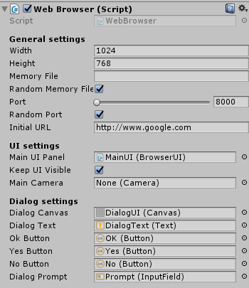

# unity_browser
Open source Unity3d web browser created by Vitaly Chashin https://bitbucket.org/vitaly_chashin/simpleunitybrowser and fixed buld crashes by Stulov Dmitry https://bitbucket.org/ShadowTeolog/simpleunitybrowser. 

## Basic setup
Import the package to Unity. There will be a few folders in Assets/SimpleWebBrowser. You can move/rename all of them, but in case of Assets/SimpleWebBrowser/PluginServer you will need to change the runtime and deployment paths in Scripts/BrowserEngine.cs and in Editor/BrowserPostBuild.cs:
```C#
 public void InitPlugin(int width, int height, string sharedfilename, int port, string initialURL)
        {

            //Initialization (for now) requires a predefined path to PluginServer,
            //so change this section if you move the folder
            //Also change the path in deployment script.

#if UNITY_EDITOR_64
            string PluginServerPath = Application.dataPath + @"\SimpleWebBrowser\PluginServer\x64";
#else
#if UNITY_EDITOR_32
        string PluginServerPath = Application.dataPath + @"\SimpleWebBrowser\PluginServer\x86";
```
The package contains two demo scenes, for the inworld and canvas browser; you can use them as a reference, or just drag one of the prefabs to the scene.

## Settings


* Width and height - width and height of the browser texture.
* Memory file and Port - in general, you can keep them random. Memory file is the name of a shared memory file, which is used to send the texture data, and port is a TCP port for the communication between browser and plugin. In case of random, memory file will be a random GUID, and a port will be between 8000 and 9000. But you can set them manually, if you want.
* Initial URL - obviously, the initial browser URL.
* WebRTC - enable/disable WebRTC support.
* UI settings - settings for the main browser controls. You can customize them the way you like, changing they appearance in editor and behaviour in BrowserUI.cs.
* Dialog settings - same as UI, but for modal dialogs.
* 2D browser setup is almost the same, except the Browser2D raw image texture setting, which is the base texture for browser.

## Deployment
The plugin works for Win32/64, both in editor and in app. The post-build step is automated, it creates a folder named PluginServer in your output folder. You can change this, for example, put the PluginServer into the Data folder, but in such case you need to change the deployment paths (see Basic Setup).

## JavaScript integration
Currently you can execute any JS code in the browser window by calling WebBrowser.RunJavaScript(string js) and send the message from the web page (see Demo/SampleJSQueryHandler.cs). On JavaScript side, you need code like this:
```JS
// Send a query to the browser process.
function sendMessage() {
  window.cefQuery({
    request: 'BindingTest:' + document.getElementById("message").value,
    onSuccess: function(response) {
      document.getElementById('result').value = 'Response: '+response;
    },
    onFailure: function(error_code, error_message) {}
  });
}
```
See BindingTest.html for an example.

## Building the PluginServer from the repository
You can build the plugin server from scratch, for example, if you want to change something in communication or page rendering.

Folder structure:
* MessageLibrary - an implementation of communication protocol
* packages - nuget folder
* SharedPluginServer - the main project
* TestClient - WinForms client for tests. Warning - the code is not cleaned up, not commented, etc.
* third_party - prebuilt libraries used in project
  * cef_64 - CEF x64 runtime
  * cef_86 - CEF x86 runtime
  * SharedMemory_86 - SharedMemory.dll for x86 builds
  * SharedMemory_86_Unity - SharedMemory.dll for Unity x86
  * SharedMemory_Unity - SharedMemory for Unity x64
  * log4net.dll
  * SharedMemory.dll - the base x64 SharedMemory realization
  * Xilium.CefGlue.dll
* UnityClient - the main Unity project.

## Building the main solution
In general, just build it. By default it set to Debug/x64; in case of building it for x86, you need to remove the references to third_party\SharedMemory.dll from SharedPluginServer and TestClient, and add the references to third_party\SharedMemory_86\SharedMemory.dll.

## Testing and debugging
Set the TestClient as the startup project. Change the path to SharedPluginServer in Form1.cs:
```C#
Process pluginProcess = new Process()
            {
                StartInfo = new ProcessStartInfo()
                {
                    WorkingDirectory =
                        //  @"D:\work\unity\StandaloneConnector\SharedPluginServerClean\UnityClient\Output\x86\PluginServer",
                        @"D:\work\unity\StandaloneConnector\SimpleUnityBrowser\SharedPluginServer\bin\x64\Debug",
                    FileName =
                     //@"D:\work\unity\StandaloneConnector\SharedPluginServerClean\UnityClient\Output\x86\PluginServer\SharedPluginServer.exe",
                        @"D:\work\unity\StandaloneConnector\SimpleUnityBrowser\SharedPluginServer\bin\x64\Debug\SharedPluginServer.exe",
                    Arguments = args

                }
            };
```
Copy the CEF runtime from the appropriate folder in third_party to the SharedPluginServer output folder, and run the TestClient. It may crash for the first time (when Windows asks for network access), but after that it should work fine.

